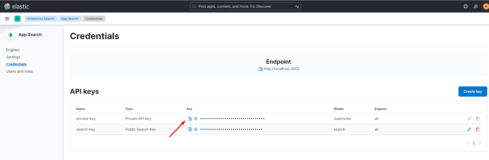

# Elastic App Search Guide

## Table of contents

- [Prerequisites](#prerequisites)
    - [Install `vc-storefront`](#install-vc-storefront)
    - [Setup `Vue B2B Theme`](#setup-vue-b2b-theme)
- [Set up Elastic App Search](#set-up-elastic-app-search)
    - [Deploy Elastic App Search using Docker](#deploy-elastic-app-search-using-docker)
    - [Set up Elastic App Search on Platform](#set-up-elastic-app-search-on-platform)
- [Running Storefont and working with App Search](#running-storefont-and-working-with-app-search)
    - [Run `vc-storefront` application](#run-vc-storefront-application)
    - [Inside Elastic App Search](#inside-elastic-app-search)

---

## Prerequisites

- Install `vc-platform` 3.x the latest version. [Deploy on Windows](https://github.com/VirtoCommerce/vc-platform/blob/master/docs/getting-started/deploy-from-precompiled-binaries-windows.md) or [Deploy on Linux](https://github.com/VirtoCommerce/vc-platform/blob/master/docs/getting-started/deploy-from-precompiled-binaries-linux.md)
- Install `vc-module-experience-api` module. [Getting started](https://github.com/VirtoCommerce/vc-module-experience-api/blob/dev/docs/getting-started.md)
- Install [vc-module-profile-experience-api](https://github.com/VirtoCommerce/vc-module-profile-experience-api) module.
- Install [Node](https://nodejs.org/en/download/) v.16.X
- Install [yarn](https://classic.yarnpkg.com/lang/en/docs/install/#windows-stable) package manager:
  ```
  npm install --global yarn
  ```

### Install `vc-storefront`

- Clone [https://github.com/VirtoCommerce/vc-storefront](https://github.com/VirtoCommerce/vc-storefront) in to a local folder

- Open the **appsettings.json** file in a text editor.
- In the **Endpoint** section change **Url**, **UserName**, **Password** with correct path and credentials for Virto Commerce Platform:

```json
 "Endpoint": {
     "Url": "https://localhost:5001",
     "UserName": "admin",
     "Password": "store"
 }
```

### Setup `Vue B2B Theme`


- Clone repo into the folder where storefront is installed
```bash
    git clone https://github.com/VirtoCommerce/vue-starter-theme.git "C:\vc-storefront\VirtoCommerce.Storefront\wwwroot\cms-content\themes\{store-name}\default"
```
- Change the current directory to the default theme directory (change `{store-name}` to the store you want to use, for example `B2B-store`) 
```bash
    cd C:\vc-storefront\VirtoCommerce.Storefront\VirtoCommerce.Storefront\wwwroot\cms-content\themes\{store-name}\default
```
- Install dependencies
```bash
    npm install
    yarn
```
- Start theme in development mode with hot reload support
```bash
yarn dev
```
- OR build the theme to get installable artifact
```bash
yarn compress
```
---
## Set up Elastic App Search

### Deploy Elastic App Search using Docker

- Install `Docker` for [Windows](https://docs.docker.com/desktop/install/windows-install/) or for [Linux](https://www.docker.com/get-started/).
- Install `Elastic App Search` Container using `Docker-Compose`.
    - Create a directory and create a file named `.env` inside:
        ```
        STACK_VERSION=8.3.3
        ELASTIC_PASSWORD=!!!changeme!!!
        KIBANA_PASSWORD=!!!changeme!!!
        ES_PORT=9200
        CLUSTER_NAME=es-cluster
        LICENSE=basic
        MEM_LIMIT=1073741824
        KIBANA_PORT=5601
        ENTERPRISE_SEARCH_PORT=3002
        ENCRYPTION_KEYS=secret
        ```
    - Create a strong password and place it instead of !!!changeme!!!
    - Create a file named `docker-compose.yml` and place it alongside `.env` file:
        ```yml
        version: "2.2"

        services:
        setup:
            image: docker.elastic.co/elasticsearch/elasticsearch:${STACK_VERSION}
            volumes:
            - certs:/usr/share/elasticsearch/config/certs
            user: "0"
            command: >
            bash -c '
                if [ x${ELASTIC_PASSWORD} == x ]; then
                echo "Set the ELASTIC_PASSWORD environment variable in the .env file";
                exit 1;
                elif [ x${KIBANA_PASSWORD} == x ]; then
                echo "Set the KIBANA_PASSWORD environment variable in the .env file";
                exit 1;
                fi;
                if [ ! -f certs/ca.zip ]; then
                echo "Creating CA";
                bin/elasticsearch-certutil ca --silent --pem -out config/certs/ca.zip;
                unzip config/certs/ca.zip -d config/certs;
                fi;
                if [ ! -f certs/certs.zip ]; then
                echo "Creating certs";
                echo -ne \
                "instances:\n"\
                "  - name: es01\n"\
                "    dns:\n"\
                "      - es01\n"\
                "      - localhost\n"\
                "    ip:\n"\
                "      - 127.0.0.1\n"\
                > config/certs/instances.yml;
                bin/elasticsearch-certutil cert --silent --pem -out config/certs/certs.zip --in config/certs/instances.yml --ca-cert config/certs/ca/ca.crt --ca-key config/certs/ca/ca.key;
                unzip config/certs/certs.zip -d config/certs;
                fi;
                echo "Setting file permissions"
                chown -R root:root config/certs;
                find . -type d -exec chmod 750 \{\} \;;
                find . -type f -exec chmod 640 \{\} \;;
                echo "Waiting for Elasticsearch availability";
                until curl -s --cacert config/certs/ca/ca.crt https://es01:9200 | grep -q "missing authentication credentials"; do sleep 30; done;
                echo "Setting kibana_system password";
                until curl -s -X POST --cacert config/certs/ca/ca.crt -u elastic:${ELASTIC_PASSWORD} -H "Content-Type: application/json" https://es01:9200/_security/user/kibana_system/_password -d "{\"password\":\"${KIBANA_PASSWORD}\"}" | grep -q "^{}"; do sleep 10; done;
                echo "All done!";
            '
            healthcheck:
            test: ["CMD-SHELL", "[ -f config/certs/es01/es01.crt ]"]
            interval: 1s
            timeout: 5s
            retries: 120

        es01:
            depends_on:
            setup:
                condition: service_healthy
            image: docker.elastic.co/elasticsearch/elasticsearch:${STACK_VERSION}
            volumes:
            - certs:/usr/share/elasticsearch/config/certs
            - esdata01:/usr/share/elasticsearch/data
            ports:
            - ${ES_PORT}:9200
            environment:
            - node.name=es01
            - cluster.name=${CLUSTER_NAME}
            - cluster.initial_master_nodes=es01
            - ELASTIC_PASSWORD=${ELASTIC_PASSWORD}
            - bootstrap.memory_lock=true
            - xpack.security.enabled=true
            - xpack.security.http.ssl.enabled=true
            - xpack.security.http.ssl.key=certs/es01/es01.key
            - xpack.security.http.ssl.certificate=certs/es01/es01.crt
            - xpack.security.http.ssl.certificate_authorities=certs/ca/ca.crt
            - xpack.security.http.ssl.verification_mode=certificate
            - xpack.security.transport.ssl.enabled=true
            - xpack.security.transport.ssl.key=certs/es01/es01.key
            - xpack.security.transport.ssl.certificate=certs/es01/es01.crt
            - xpack.security.transport.ssl.certificate_authorities=certs/ca/ca.crt
            - xpack.security.transport.ssl.verification_mode=certificate
            - xpack.license.self_generated.type=${LICENSE}
            mem_limit: ${MEM_LIMIT}
            ulimits:
            memlock:
                soft: -1
                hard: -1
            healthcheck:
            test:
                [
                    "CMD-SHELL",
                    "curl -s --cacert config/certs/ca/ca.crt https://localhost:9200 | grep -q 'missing authentication credentials'",
                ]
            interval: 10s
            timeout: 10s
            retries: 120

        kibana:
            depends_on:
            es01:
                condition: service_healthy
            image: docker.elastic.co/kibana/kibana:${STACK_VERSION}
            volumes:
            - certs:/usr/share/kibana/config/certs
            - kibanadata:/usr/share/kibana/data
            ports:
            - ${KIBANA_PORT}:5601
            environment:
            - SERVERNAME=kibana
            - ELASTICSEARCH_HOSTS=https://es01:9200
            - ELASTICSEARCH_USERNAME=kibana_system
            - ELASTICSEARCH_PASSWORD=${KIBANA_PASSWORD}
            - ELASTICSEARCH_SSL_CERTIFICATEAUTHORITIES=config/certs/ca/ca.crt
            - ENTERPRISESEARCH_HOST=http://enterprisesearch:${ENTERPRISE_SEARCH_PORT}
            mem_limit: ${MEM_LIMIT}
            healthcheck:
            test:
                [
                    "CMD-SHELL",
                    "curl -s -I http://localhost:5601 | grep -q 'HTTP/1.1 302 Found'",
                ]
            interval: 10s
            timeout: 10s
            retries: 120

        enterprisesearch:
            depends_on:
            es01:
                condition: service_healthy
            kibana:
                condition: service_healthy
            image: docker.elastic.co/enterprise-search/enterprise-search:${STACK_VERSION}
            volumes:
            - certs:/usr/share/enterprise-search/config/certs
            - enterprisesearchdata:/usr/share/enterprise-search/config
            ports:
            - ${ENTERPRISE_SEARCH_PORT}:3002
            environment:
            - SERVERNAME=enterprisesearch
            - secret_management.encryption_keys=[${ENCRYPTION_KEYS}]
            - allow_es_settings_modification=true
            - elasticsearch.host=https://es01:9200
            - elasticsearch.username=elastic
            - elasticsearch.password=${ELASTIC_PASSWORD}
            - elasticsearch.ssl.enabled=true
            - app_search.engine.total_fields.limit=128
            - elasticsearch.ssl.certificate_authority=/usr/share/enterprise-search/config/certs/ca/ca.crt
            - kibana.external_url=http://kibana:5601
            mem_limit: ${MEM_LIMIT}
            healthcheck:
            test:
                [
                    "CMD-SHELL",
                    "curl -s -I http://localhost:3002 | grep -q 'HTTP/1.1 302 Found'",
                ]
            interval: 10s
            timeout: 10s
            retries: 120

        volumes:
        certs:
            driver: local
        enterprisesearchdata:
            driver: local
        esdata01:
            driver: local
        kibanadata:
            driver: local
        ```

        > Note that there're custom settings for `enterprisesearch` in yml file:
        >
        > *app_search.engine.total_fields.limit=128* 
    - Bring up the Elastic cluster with the following command (execute it from the directory where the `.yml` file is):
        ```
        docker-compose up
        ``` 
    - Access Kibana at http://localhost:5601. Log in with user `elastic`. The password is the value you provided for ELASTIC_PASSWORD in your .env file. Access Elasticsearch at http://localhost:9200.
        > More info on deploying using Docker at [Elastic App Search Docker](https://www.elastic.co/guide/en/enterprise-search/8.3/docker.html)

### Set up Elastic App Search on Platform

- Install [vc-module-elastic-app-search](https://github.com/VirtoCommerce/vc-module-elastic-app-search) module.
- Modify Platform configuration to use Elastic App Search
```json
"Search": {
    "Provider": "ElasticAppSearch",
    "Scope": "default",
    "ElasticAppSearch": {
        "Endpoint": "https://localhost:3002",
        "PrivateApiKey": "private-key"
    }
}
```
- Open `Kibana` (localhost:5601), navigate to `Enterprise Search` - `Open App Search` - `Credentials`, copy Private Key and assign it to PrivateApiKey setting.

    

- Run the Platform and build the indices. You should see that Provided is `ElasticAppSearch`. 

    

- Navigate back to `Kibana` and confirm that Engines (indices) are created.

    
---

## Running Storefont and working with App Search

### Run `vc-storefront` application

- Navigate to the Storefront root directory
```bash
cd C:\vc-storefront\VirtoCommerce.Storefront
```
- Build and run storefront application
```bash
dotnet run
```

### Inside Elastic App Search

- In `Kibana` open App Search `Engines` overview page. Here can see four Engines that were created after we rebuilt the indices. If we click on `products` engine we can see general analytics about incoming queries and can manage indexed documents and tune engine behavior with `Relevance Tuning`, `Synonyms` and `Curations`.

- Open `Documents` menu to examine all indexed documents and their contents. 

- Open `Schema` menu to look at what fields are present in the documents. We can examine product index contents in Platform admin UI by opening a products blade and clicking on Index widget. 

- Open `Synonyms` and add search query synonyms. By associating the 'Sony' keyword with 'Samsung' keyword and trying out the same query as before we can see that result set is different - we also get all documents that are relevant to the 'Samsung' keyword. Go to Storefront and see that integration works and we get `Sony` and `Samsung` products by `Sony` keyword.


- `Curations` is a tool by which we handpick results for certain search queries. Search by `Sony` keyword again and examine the entries. Here we can delete a certain document from result set by clicking the delete button and a new document by clicking the `Add manually` button and selecting a document from a different result set. Save the curation and check it in the Storefront.

